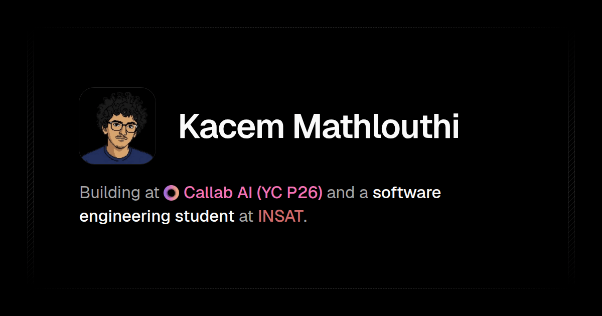

<h1 align="center">Kacem Mathlouthi</h1>

  

  
  
  
  
  
  

  Code is <a href="LICENSE">MIT</a>. The brand marks in <code>public/logos/</code> and the personal content (avatar, résumé, bio copy, OG image) are not.

